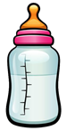
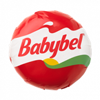
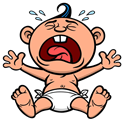
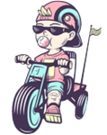
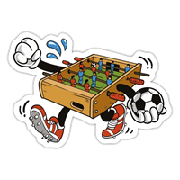
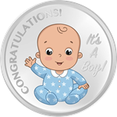
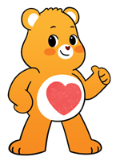
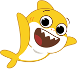
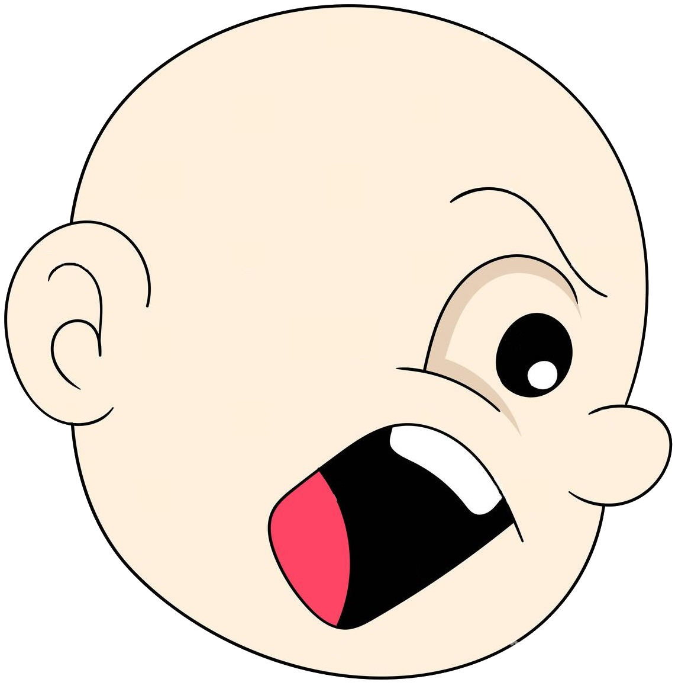
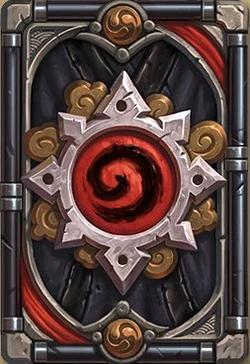

<h1 align="center">EXPLODING CHILDREN</h1>

## Crédits

    
    Cette image utilisée dans ce projet est fournie par <a href="https://www.istockphoto.com/fr/portfolio/nickylarson974?mediatype=illustration">nickylarson974</a> et est sous licence <a href="https://www.istockphoto.com/fr/help/licenses">Standard</a>. Vous pouvez la trouver <a href="https://www.istockphoto.com/fr/vectoriel/bouteille-de-b%C3%A9b%C3%A9-de-dessin-anim%C3%A9-de-vecteur-isolated-gm1224517539-360082491">ici</a>.

    
    Cette image utilisée dans ce projet est fournie par <a href="https://www.abcfoodservice.it/fr/autres-fromages/babybel-fromage-mini-gr20x5">abcfoodservice</a> et est sous licence <a href="https://www.abcfoodservice.it/fr/autres-fromages/babybel-fromage-mini-gr20x5">Inconnue</a>. Vous pouvez la trouver <a href="https://www.abcfoodservice.it/fr/autres-fromages/babybel-fromage-mini-gr20x5">ici</a>.

    
    Cette image utilisée dans ce projet est fournie par <a href="https://www.dreamstime.com/larryrains_info">Larry Rains</a> et est sous licence <a href="https://www.dreamstime.com/about-stock-image-licenses">Royalty Free</a>. Vous pouvez la trouver <a href="https://www.dreamstime.com/stock-illustration-cry-baby-vector-illustration-image53855876">ici</a>.

    
    Cette image utilisée dans ce projet est fournie par <a href="https://fr.freepik.com/auteur/ksania">Ksania</a> et est sous licence <a href="https://www.freepikcompany.com/legal/#nav-freepik-license">Premium</a>. Vous pouvez la trouver <a href="https://fr.freepik.com/vecteurs-premium/cool-petit-garcon-velo-bulle-gomme-pour-conception-chemise-pour-enfant-bebe-tout-petit-casquette-equitation-tricycle-illustration-vectorielle-pour-impressions-logos-produits-pour-enfants-coolness_26192421.htm">ici</a>.

    
    Cette image utilisée dans ce projet est fournie par <a href="https://www.spreadshirt.fr/shop/design/sport+baby-foot+autocollant-D611de7bb6a1fcb273da935c8?sellable=lzN41xr5JdFqw9loogZg-1459-215">spreadshirt</a> et est sous licence <a href="https://www.spreadshirt.fr/shop/design/sport+baby-foot+autocollant-D611de7bb6a1fcb273da935c8?sellable=lzN41xr5JdFqw9loogZg-1459-215">Inconnue</a>. Vous pouvez la trouver <a href="https://www.spreadshirt.fr/shop/design/sport+baby-foot+autocollant-D611de7bb6a1fcb273da935c8?sellable=lzN41xr5JdFqw9loogZg-1459-215">ici</a>.

    
    Cette image utilisée dans ce projet est fournie par <a href="https://www.mions.fr/agenda/jeu-de-lintrus/">mions</a> et est sous licence <a href="https://www.mions.fr/agenda/jeu-de-lintrus/">Inconnue</a>. Vous pouvez la trouver <a href="https://www.mions.fr/agenda/jeu-de-lintrus/">ici</a>.

    
    Cette image utilisée dans ce projet est fournie par <a href="https://fr.dreamstime.com/bolid2000_info">Bolid2000</a> et est sous licence <a href="https://fr.dreamstime.com/illustration-stock-b%C3%A9b%C3%A9-sourire-n%C3%A8gre-image88963545">Libre de droits</a>. Vous pouvez la trouver <a href="https://fr.dreamstime.com/illustration-stock-b%C3%A9b%C3%A9-sourire-n%C3%A8gre-image88963545">ici</a>.

    
    Cette image utilisée dans ce projet est fournie par <a href="https://www.goldgiftideas.com/product/999-pure-silver-congratulation-coin-for-gift-its-boy-new-born-baby-coin-return-gifts-for-baby-shower-silver-coin-for-gift/">goldgiftideas</a> et est sous licence <a href="https://www.goldgiftideas.com/product/999-pure-silver-congratulation-coin-for-gift-its-boy-new-born-baby-coin-return-gifts-for-baby-shower-silver-coin-for-gift/">Inconnue</a>. Vous pouvez la trouver <a href="https://www.goldgiftideas.com/product/999-pure-silver-congratulation-coin-for-gift-its-boy-new-born-baby-coin-return-gifts-for-baby-shower-silver-coin-for-gift/">ici</a>.

    
    Cette image utilisée dans ce projet est fournie par <a href="https://carebears.com/fr/">Care Bears</a> et est sous licence <a href="https://carebears.com/fr/terms-of-use/">Inconnue</a>. Vous pouvez la trouver <a href="https://www.tiji.fr/Heros/Les-Bisounours">ici</a>.

    
    Cette image utilisée dans ce projet est fournie par <a href="https://www.gulli.fr/Chaine-TV/Dessins-animes/Baby-Shark/Les-personnages/Baby-Shark">Smart Study Co., Ltd</a> et est sous licence <a href="https://www.gulli.fr/Conditions-Generales-d-Utilisation">Protégé</a>. Vous pouvez la trouver <a href="https://www.gulli.fr/Chaine-TV/Dessins-animes/Baby-Shark/Les-personnages/Baby-Shark">ici</a>.

    
    Cette image utilisée dans ce projet est fournie par <a href="https://fr.freepik.com/auteur/artwork">ar_twork</a> et est sous licence <a href="https://www.freepikcompany.com/legal/#nav-freepik-license">Premium</a>. Vous pouvez la trouver <a href="https://fr.freepik.com/photos-premium/garcon-chauve-expression-colere_52647702.htm#fromView=search&page=1&position=17&uuid=885eda8e-8c56-434b-b61d-d881ae2ba9dc">ici</a>.

    
    Cette image utilisée dans ce projet est fournie par <a href="https://hearthstone.blizzard.com/fr-fr">Hearthstone</a> et est sous licence <a href="https://www.fandom.com/fr/licensing-fr">CC-BY-SA</a>. Vous pouvez la trouver <a href="https://hearthstone.fandom.com/fr/wiki/Dos_de_carte">ici</a>.

Audio source : 
SFX :
https://pixabay.com/sound-effects/search/magical/
Valorant defuse
https://pixabay.com/fr/sound-effects/card-sounds-35956/
https://pixabay.com/fr/sound-effects/shuffle-cards-46455/

Music :
https://www.youtube.com/watch?v=PEI2zet48Uc&ab_channel=DrSaxLove
