<h1 align="center">EXPLODING CHILDREN</h1>

	

## Synopsis

Explosing Children est un jeu de cartes dans le style de Exploding Kitten. Le but du jeu est de poser des cartes afin de faire rire un bébé et ainsi l'empêcher d'exploser en sanglots. 

## Cartes

Pour cela, le joueur possède les cartes suivantes :

	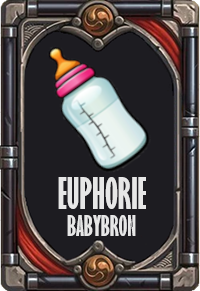
	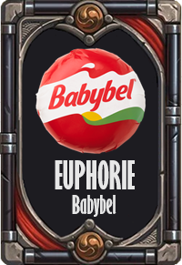
	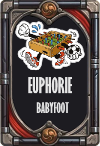
	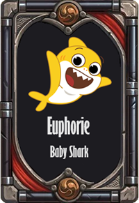
	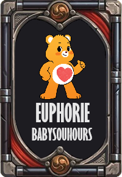

Ces cartes permettent de faire rire le bébé et gagner des points. Pour l'aider dans sa quête, le joueur peut également piocher des cartes qui ne rapporte pas de points mais qui ont des effets interessants :

	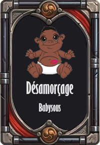
	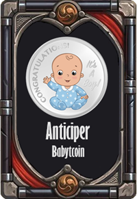
	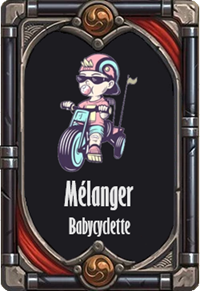
	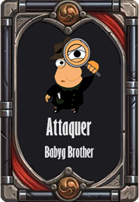

Dans l'ordre, Babysous permet de d'arrêter les pleures du bébé et ainsi ne pas perdre, Babytcoin permet de voir les 3 prochaines cartes du paquet, Babycyclette permet de mélanger le paquet et finalement Babyg Brother permet de gagner la partie si le première carte de la pioche est la carte explosion. En cas de victoire, le joueur gagne beaucoup de points.

	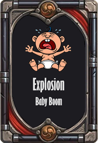

Et finalement la carte explosion qui fait perdre le partie si le joueur n'a pas la carte Babysous.

## Gameplay

Le jeu se déroule en plusieurs tours. A chaque tour, le joueur peut poser une carte de son choix ou piocher. 

https://github.com/Aymerix01/CXXProject/assets/123820772/c3c9f4c6-d81c-4828-9f07-28c8c2611f9e

## Diagramme de classes

	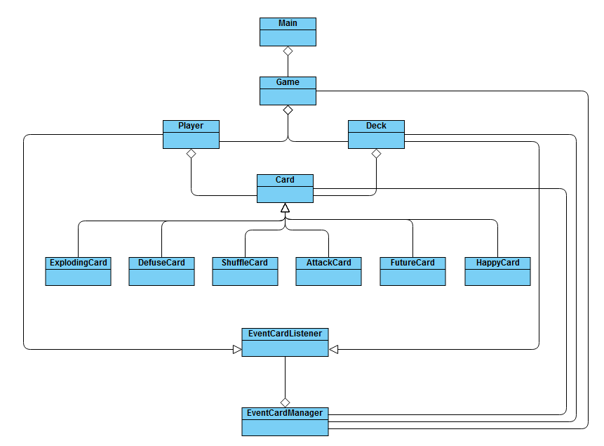

